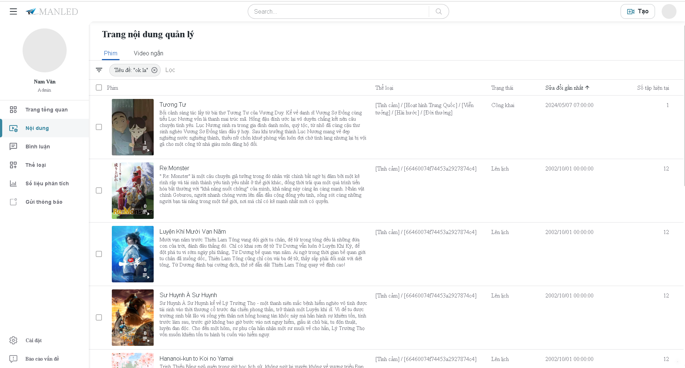

Khó khăn: Gặp một số vấn đề mới lạ, chưa từng được học. Thiết kế giao diện.
Kết quả đạt được: có thêm kinh nghiệm về Reactjs như: hook, tối ưu giao diện, tạo các component tái sử dụng (có thể sử dụng cho dự án khác), có thêm kinh nghiệm về đề tài.

Quản lý phim:

Thêm phim:

Thêm tập phim:

